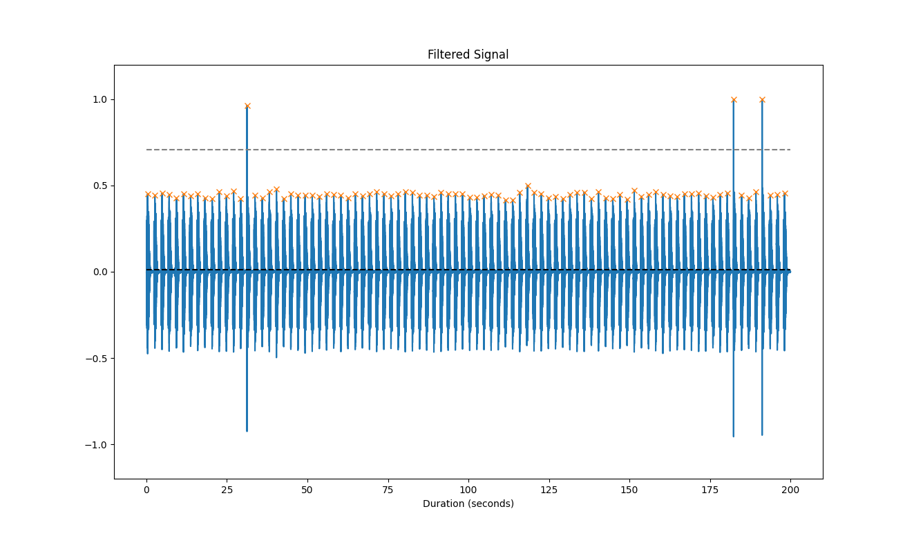

# Fez Map Ping Extractor

Extracts ones (chime with ping) and zeros (chime without ping) from an audio recording of the Fez map.


## How to use

Requires python 3 (only tested with 3.9)

1. Create a python environment  
   ```sh
   python3.9 -m venv --upgrade-deps venv
   ```
2. Activate the environment  
   ```sh
   source venv/bin/activate      # linux/mac
   source venv/Scripts/Activate  # Windows
   ```
3. Install dependencies
   ```sh
   pip install -r requirements
   ```
4. Run it
   ```sh
   python map-ping-extractor.py <path-to-file>
   ```
   <details>
   <summary>See usage</summary>
   
   ```
   $ python map-ping-extractor.py --help
   usage: map-ping-extractor.py [-h] [--visualize] [--offset OFFSET] [--duration DURATION] [--background BACKGROUND] [--partition PARTITION]
                                file
   
   positional arguments:
     file                  audio file of map ping to analyze
   
   optional arguments:
     -h, --help            show this help message and exit
     --visualize           show the plot (WARNING! Slow for big files)
     --offset OFFSET       offset in seconds into the file to start parsing
     --duration DURATION   for how many seconds to parse
     --background BACKGROUND
                           manually set the background threshold value above where peaks should be found (DEFAULT: determined automatically)
     --partition PARTITION
                           manually set the partition value threshold to separate ping and chime peaks (DEFAULT: determined automatically)
   ```
   </details>

<details>
<summary>Example output</summary>

*Program terminal output:*

```
$ python map-ping-extractor.py long-capture-map-ping.ogg --duration 200 --visualize                                                                                                                                                                                                   ⬢ system
Loading file...
Filtering...
Normalizing...
Detecting peaks...
Analysis metrics:
  Background threshold: 0.014
   Partition threshold: 0.708
         Ping variance: 0.037
        Chime variance: 0.084
   Ping-chime distance: 0.542

Extracted output:
000000000000001000000000000000000000000000000000000000000000000000000000000000000010001000 

Loading visualization. NOTE! This is CPU and memory intensive for big files.
```

*Visualization:*


</details>

## Audio capture

Due to being on a Mac and not being able to easil record playback audio for more
than 20 min without purchasing software for $124 ([loopback][loopback]). I opted
for recoding it with a microphone out of the speaker. The noise introduced I could
work around with the code.

[loopback]: https://rogueamoeba.com/loopback/

Room background sounds are also played in the map. I chose to stand in Ladder
Tower room (one with the treasure chest at the top) because the background sounds
in that room are quite quiet and low frequency. This meant I could easily filter
that out when coding to automatically extract the chime and ping. Music was obviously
turned off.

When in the map I navigated a bit away from the current room node chime to quiet
it (since it is direction) to make the sourceless ping more prominent in volume
compared to it. This might not have be necessary.


## Extracted data

I have recorded a bit over an hour, and extracted it to the following bits.
Get it [here][source-audio].

[source-audio]: https://drive.google.com/file/d/1d_Xo8uryVaCIeCYvZLl85rBM6HlUp92P/view

<details>
<summary>Extracted data</summary>

`0`s are the current room node chimes without a ping, and `1`s where the ping was present.  
*Note!* I've grouped 64 bits per line for no other reason than of readability.

```
0000000000000010000000000000000000000000000000000000000000000000
0000000000000000001000100000000000000000000000000100000000000000
0000000000000000000000000010000000000000001000000000000001000000
0000000000000100000000000000000000000000000000000000000000000000
0000000000001000000000000000100000000010000000001000000000000000
0000010000000001000001000000000100000000000000010000000000000000
0000000000000000000000000100000000000000000000000000000000000000
0000000000000000000000000000000000000010000000000000000000100000
0000000000010000000000000000000000000000000000000001000000000000
0000000000000000000000000000000000000000000000100000000000001000
0000000100000000000000000000000000000000000000001000010000000000
0000000001100000000000000010000000000010010000000000000000000000
0000000010000000000000000000000000000000000000000000000000000000
0100000000000000000000000000000000000000000100000000000000000001
0000000000000000000001000000001000001000000000100000000000000010
0000000010000000000000000000000000000000000000000100000000000000
0000000000000000000000000000000000000000000000000000000000100000
0000000001000000000000000100000000010000000000000000000000001000
0000000001000000001000000000100000010000000000000000000100000000
0000001000000000000001000000000000000000000000001000000000000001
0000000000000000000000000010000000000000010000000000000000000000
0000100000000000010000000000000001000000000000000000000000000000
0100000000100000000000000000000000000000000000000000100000000001
0001000000000010000000000000000000000000000000000000000000000100
0000000000000000000000000000000000000000000000000000000000000000
0000000000000000000000000000000000000000001000000000010000000000
0000000001000000000000000000000000000000000000000000000000001000
0010000000000000000000000000001000000000000110000000010000000000
0000010000000000000000100000000000000000000000000000100000000000
0000100000000000000000001000000000000000000000000000000000000100
0010000000000000000000010000000011000000000000000000000000000001
0000000000
```
</details>


## Analysis and conclusion

I tried looking at the intervals between ones, but it was anything between 0 and
108 chimes. I've been expecting 64 to be the biggest coherent unit (if there was one)
due to the relevance in the game, but with that variability there would be no way of
grouping (that I can see) where there's a lot of nothing.

Thus far it seems random. It doesn't match up with any of my previous 15-20 min
recordings. And if this was to be a message to decode, there should be some way
of knowing when the message is over and repeated, which I can't find. Expecting
that window to be more than the hour I've checked makes me think there isn't
anything here. Oh, well.

Also the point that [someone remembered][qa] at the map was added as a QA request.
That along with the seeming lack of reference to the map within the game.

[Reddit thread of all above.][reddit-thread]

[qa]: https://www.reddit.com/r/Fez/comments/stls8z/comment/hxcxfa2/
[reddit-thread]: https://www.reddit.com/r/Fez/comments/stls8z/ping_sound_in_room_map_monolith_relevance/
